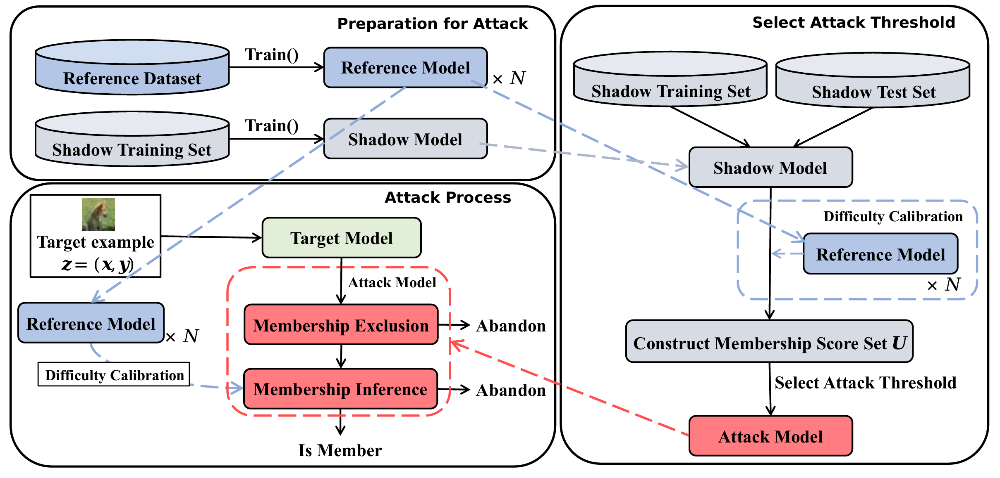

# HP-MIA
HP-MIA: A novel membership inference attack scheme for high membership prediction precision




## Code
The core of the code for HP-MIA (PyTorch implementation).

This repository provides the functions for calculating the membership scores (`HP-MIA/Compute_score.py`) as well as the architecture of the neural network models used for testing (`HP-MIA/models.py`). Two ipynb files provide the implementation on Purchase100. `HP-MIA/Train_ref_Purchase.ipynb` provides codes to train the target model/shadow model/reference model. The target model and shadow model are stored in `HP-MIA/target_shadow`. 100 well-trained reference models for Purchase100 are stored in `HP-MIA/ref_purchase`. `HP-MIA/attack_exp_purchase.ipynb` tested Two-stage HP-MIA on Purchaser100.


Please refer to `HP-MIA/requirements.txt` to configure the environment.

This implementation references codes from [ml-leaks-pytorch](https://github.com/GeorgeTzannetos/ml-leaks-pytorch), 
[membership-inference-evaluation](https://github.com/inspire-group/membership-inference-evaluation) and [Purchase100 and Texas100 dataset](https://github.com/xehartnort/Purchase100-Texas100-datasets). Thank the authors for their  work !

## Abstract

Membership Inference Attacks (MIAs) have been considered as one of the major privacy threats in recent years, especially in machine learning models. Most canonical MIAs identify whether a specific data point was presented in the confidential training set of a neural network by analyzing its output pattern on such data point. However, these methods heavily rely on overfitting and are difficult to achieve high precision. Although some recent works, such as difficulty calibration techniques, have tried to tackle this problem in a tentative manner, identifying members with high precision is still a difficult task.

To address above challenge, in this paper we rethink how overfitting impacts MIA and argue that it can provide much clearer signals of non-member samples. In scenarios where the cost of launching an attack is high, such signals can avoid unnecessary attacks and reduce the attack's false positive rate. Based on our observation, we propose High-Precision MIA (HP-MIA), a novel two-stage attack scheme that leverages membership exclusion techniques to guarantee high membership prediction precision. Our empirical results have illustrated that our two-stage attack can significantly increase the number of identified members while guaranteeing high precision.


## Paper Link

[Aminer](https://static.aminer.cn/upload/pdf/28/1035/1355/65497cb4939a5f4082b36359_1.pdf)

[Elsevier](https://www.sciencedirect.com/science/article/abs/pii/S0167404823004819)

## Citation
```
@article{Chen2024HPMIA,
  title={HP-MIA: A novel membership inference attack scheme for high membership prediction precision},
  author={Shi Chen and Wennan Wang and Yubin Zhong and Zuobin Ying and Weixuan Tang and Zijie Pan},
  journal={Computers \& Security},
  volume={136},
  pages={103571},
  year={2024},
  publisher={Elsevier}
}
```

## Contact
If there is anything you would like to discuss, please contact shichen2001x@gmail.com.
